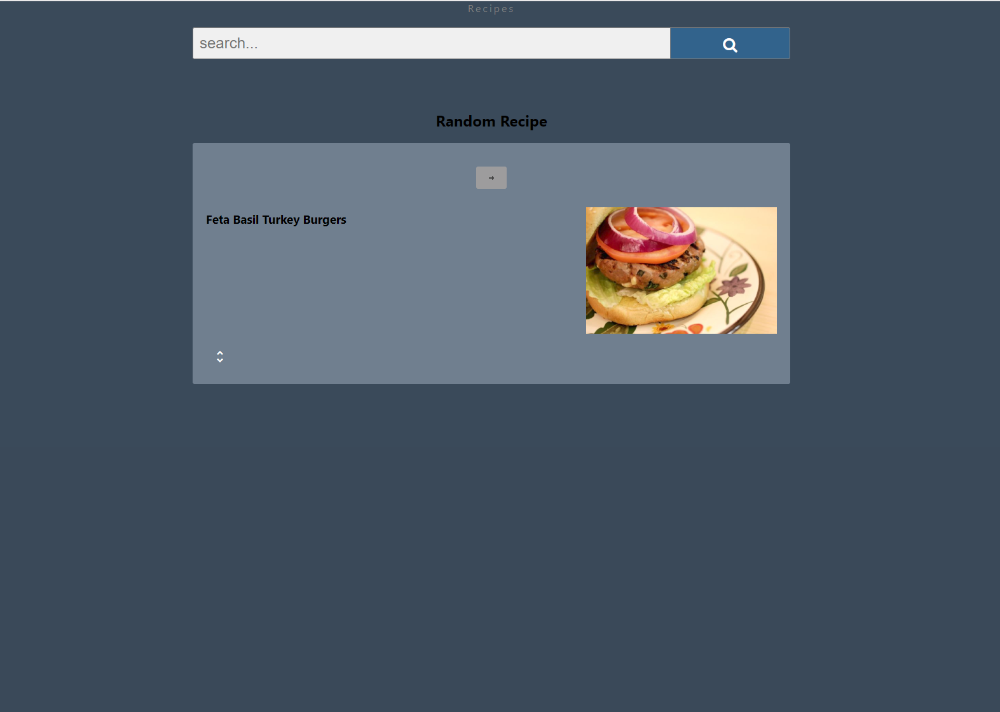
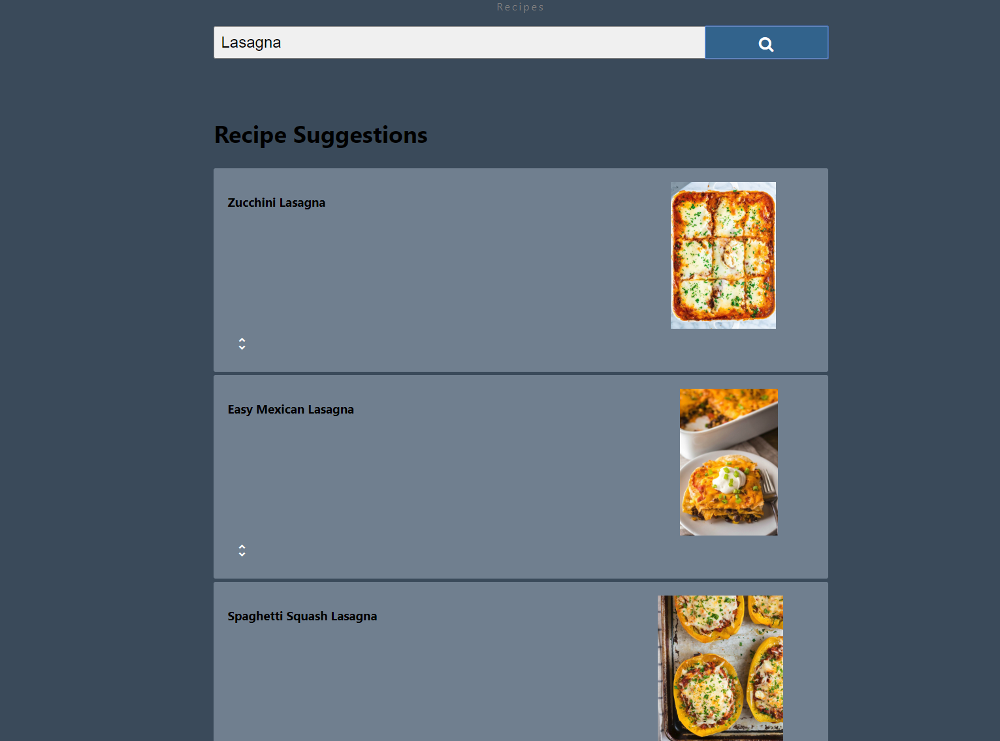
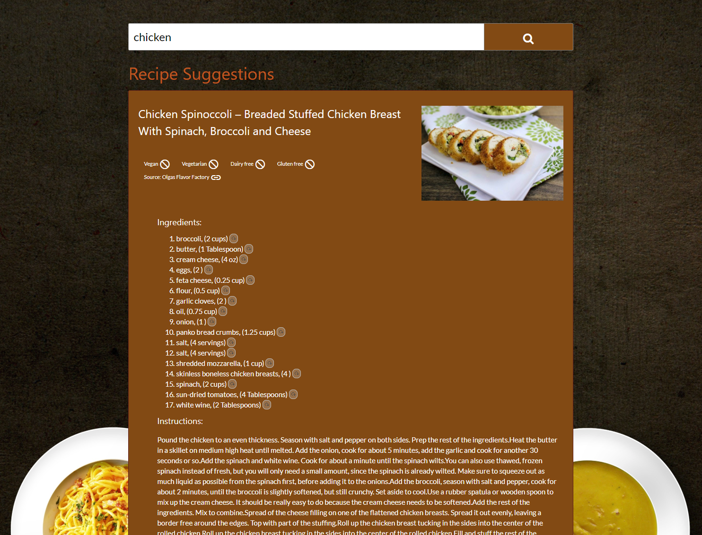

# recipe-finder

## Demo

- [Live Demo](https://runnerbrain.github.io/recipe-finder/)

## Screenshots
Landing Page:

Recipe Suggestions View:

Recipe Details view:

## Summary

1. Recipe finder is a simple and light weight web app that finds your recipes suggestions using the spoonacular api.
2. The user lands on a landing page that displays a random recipe for inspiration. The user can keep browsing random recipes by clicking on the next button.
3. The user can also enter a search term for an ingredient or a recipe name , such as Lasagna or chicken or both and will be give a list of 10 recipes per page.
4. The user is given the option to load more recipes when they scroll down to the bottom of the page should he or she chooses to.
5. The user can then select to display the details of a recipe by clicking on an 'unfold-more' link which shows the ingredients and the instrcutions (if they exist).
6. Each ingredient item has a substitute link which, when clicked, displays a list of substitutes for the ingredients if they exist.

### Technology used
* HTML
* CSS
* JQuery, JQuery UI